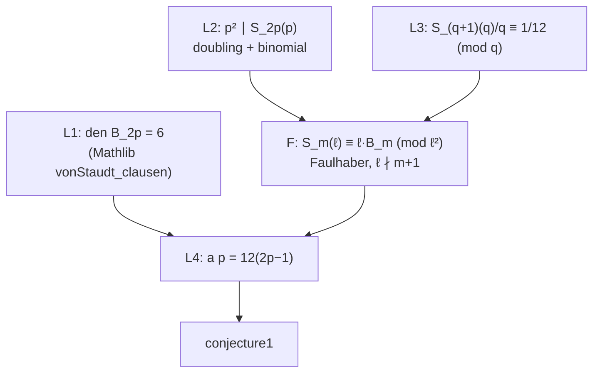

# PRD: OEIS A046969 Conjecture I, Stirling-Series Denominators

Sep 24, 2026 · Draft for Jack Burrus (scout survey)

## Summary

Target: `OeisA46969.conjecture1` in google-deepmind/formal-conjectures, `FormalConjectures/OEIS/46969.lean:124-125` at main `2424bb4` (Sep 24, 2026).
Lorenzo Sauras Altuzarra conjectured on Oct 13, 2020 that a(p)/12 is prime for every prime p > 3 such that 2p − 1 is also prime.
Here a(n) is the denominator of B_{2n}/(2n(2n − 1)).
The goal is a kernel-checked Lean proof against the untouched upstream statement, verified with Comparator, followed by an upstream PR that the owner opens.

Why this one: the statement is true, and it has a short elementary proof that is not written down anywhere.
For every such p, a(p) = 12(2p − 1) exactly, so a(p)/12 = 2p − 1, which is prime by hypothesis.
The proof uses von Staudt–Clausen, which Mathlib already has at our pin, plus two congruences for power sums that follow from a permutation trick.
FC restated the conjecture on Sep 11, 2026, and no benchmark has targeted it in its current form.

## Verification of open status

Every source checked on Sep 24, 2026 lists Conjecture I as unsolved.
Only Conjecture II has been settled: it was disproved at n = 236791.

| Source | What it says | Checked |
| --- | --- | --- |
| formal-conjectures main `2424bb4` | `conjecture1` is `research open` with no `formal_proof`. `conjecture2` is `research solved` (false at n = 236791), with a link to Epoch's Lean proof. | File read |
| FC issue #5693 and PR #5745 | The old `conjecture1` quantified over an unguarded index, which implicitly asserted that there are infinitely many primes p with 2p − 1 prime. The Sep 11, 2026 fix restates it over primes p with 2p − 1 prime and p > 3. | Issue and PR read |
| FC open PRs (449 listed) and GitHub search for "46969" | No open PR or issue touches Conjecture I. | Searched Sep 24 |
| OEIS A046969, rev 66 (Aug 22, 2026) | Conjecture I is stated as a conjecture. The only resolution note says Adamczewski found a counterexample to Conjecture II. History revisions 57–66 concern only Conjecture II. | Live entry read |
| Epoch OEIS Open (arXiv:2608.11941) and LeanOpenProblems-results | The dataset contains only `oeis_a046969_conjecture_2`, one of the 492 problems. Across all 24 run directories, Conjecture I was never a task. The paper mentions only Conjecture II. | Dataset and run trees read |
| AlphaProof Nexus results | The attempted set is the same 492-problem `auto_oeis` branch, and no output mentions A046969. | Repo grepped |
| Meta atlas-lean and atlas-fc-verified | Nine FC solutions (A108081, A211417, A22030, Erdős 138 and 337, Green 25, OQP 35, WOWII 100 and 314). A046969 is not among them. | Tree listed |
| Web, arXiv, MathOverflow | No proof found, and no remark that a(p) = 12(2p − 1). | Several queries |

Residual risk: the proof is short, so anyone who looks closely will find it.
Epoch and others re-run agents on updated FC statements, so re-check FC and GitHub on the day work starts.

## Problem background

```lean
def a (n : ℕ) : ℕ :=
  if n = 0 then 0 else
    let m := 2 * n
    let k := m * (m - 1)
    (bernoulli m / (k : ℚ)).den

theorem conjecture1 (p : ℕ) (hp : p.Prime) (hp' : (2 * p - 1).Prime) (h3 : 3 < p) :
    (a p / 12).Prime
```

Write q = 2p − 1 and B_{2p} = N/D in lowest terms.
The proof has four steps.

1. **D = 6.** By von Staudt–Clausen, D is the product of the primes r with r − 1 dividing 2p, so r ∈ {2, 3, p + 1, 2p + 1}. The number p + 1 is even and larger than 2. Since 3 divides neither 2p nor q, it divides 2p + 1, which is larger than 3. So D = 6, and N is coprime to 6.
2. **p divides N.** Let S_m(ℓ) = Σ_{k<ℓ} k^m. Multiplication by 2 permutes the residues 1..p − 1. Also (r + p·t)^{2p} ≡ r^{2p} (mod p²), because p divides the exponent. So 2^{2p}·S_{2p}(p) ≡ S_{2p}(p) (mod p²). Since 2^{2p} − 1 ≡ 3 (mod p) is a unit, p² divides S_{2p}(p). Faulhaber's formula gives S_{2p}(p) ≡ p·B_{2p} (mod p²), because every lower term carries p³ times a B_i with v_p(B_i) ≥ −1 and p ∤ 2p + 1. So v_p(B_{2p}) ≥ 1.
3. **q does not divide N.** Note 2p = q + 1. The same doubling argument modulo q², where now (r + q·t)^{q+1} ≡ r^{q+1} + q·t·r^q, gives (2^{q+1} − 1)·S_{q+1}(q) ≡ q·Σ_{j odd, j ≤ q−2} j^q (mod q²). Reduce mod q: 2^{q+1} ≡ 4, and the odd-number sum is ((q − 1)/2)² ≡ 1/4. So S_{q+1}(q)/q ≡ 1/12 (mod q), which is nonzero. Faulhaber (q ∤ 2p + 1) then gives v_q(B_{2p}) = 0.
4. **Assemble.** B_{2p}/(2p·q) = N/(12pq) = N′/(12q), where N = pN′ and N′ is coprime to 2, 3 and q. So a(p) = 12q, and a(p)/12 = q is prime.

This is the Kummer congruence B_{2p}/(2p) ≡ B_2/2 (mod q) and Adams's theorem, both proved from scratch for this one case.

## Goals and non-goals

Goals:

- A sorry-free Lean proof of `OeisA46969.conjecture1` against the merged statement, using only the three standard axioms (no `native_decide`), and a Comparator pass.
- Material the owner can use for an FC PR (flip to `research solved`, add a `formal_proof` link) and an OEIS comment giving the closed form a(p) = 12(2p − 1).

Non-goals:

- `conjecture2` (already solved), and general Kummer congruences.
- Upstreaming anything to Mathlib. The power-sum lemmas could go there later.

## Approach



1. L1 (small): instantiate `Bernoulli.vonStaudt_clausen p` (Mathlib/NumberTheory/Bernoulli.lean:665, rev `0df444a`, the same Mathlib that FC main and our pin use). Show that the filtered prime set below 2p + 2 is {2, 3}, then read off `(bernoulli (2*p)).den = 6`.
2. F (medium): the p-adic Faulhaber step, from Mathlib `sum_range_pow` (line 295) and the per-term bound v_ℓ(B_i) ≥ −1 (von Staudt–Clausen for even i; B_1 = −1/2; odd B_i = 0 by `bernoulli_eq_zero_of_odd`). The accepted Epoch proof of Conjecture II already contains this machinery: `padicValRat_bernoulli_ge`, `bernoulli_val_setup`, `val_ge` and `val_eq` at lines 107–379 of its `Spec.lean`, linked from FC. That repo has no license file, so treat it as a reference and write our own code.
3. L2 and L3 (medium): pure power-sum congruences, first in `ZMod (ℓ^2)`: the permutation k ↦ 2k mod ℓ, then one binomial expansion. L3 also evaluates Σ_{j odd} j ≡ ((q − 1)/2)² (mod q).
4. L4 (small): `Rat.den` arithmetic via `Rat.div_num_den`-style lemmas, or `padicValNat` per prime as in Epoch's `a_val`.

Numerics: `numerics/check.py` is standard library with exact Fraction and int arithmetic.

- a(p) = 12(2p − 1) and den(B_2p) = 6 for all 17 qualifying p ≤ 400, computed exactly.
- It matches the OEIS b-file for all 33 qualifying p ≤ 1000.
- L2 and L3 hold for all 310 qualifying p ≤ 20000.

## Tooling and agent workflow

Mirror `problems/oeis-a060841/lean/`: a Lake project pinned to FC by commit, with `Main.lean` importing upstream `FormalConjectures.OEIS.«46969»` and one lemma file per step (L1, F, L2, L3, L4) importing only the Mathlib modules it needs.
Run `scripts/shared-lake.sh`, and keep `scripts/check.sh` as the build-and-axiom gate.
Run Comparator against an untouched copy of the statement, as for A060841.

## Milestones

| Day | Milestone | Done when |
| --- | --- | --- |
| 0 | Re-verify open status and bump the FC pin to current main | FC still shows `research open`, no competing PR, `lake build` is green |
| 1 | L1 and the L4 assembly, with L2 and L3 as `sorry` | The main theorem compiles modulo two lemmas |
| 2–3 | F and L2 | Both compile with no sorry |
| 3–4 | L3 | Compiles with no sorry |
| 5 | Axiom check and Comparator | Only standard axioms, and Comparator passes |

## Success criteria

- Comparator accepts the proof against FC's `conjecture1` at a pinned commit.
- The owner's PR marks it `research solved` with a `formal_proof` link, and the OEIS comment gives a(p) = 12(2p − 1) with a one-paragraph proof.
- Credit is recorded as human+ai, source-accepted once merged.

## Risks and open questions

| Risk | Likelihood | Mitigation |
| --- | --- | --- |
| Scooped, since the proof is short and the statement is public and freshly restated | High | Start immediately. L1 and L4 first give a checkable skeleton on day 1 |
| `Rat.den` and `padicValRat` API friction | Medium | Follow Epoch's `a_val` and `padicValNat_den_eq` patterns (reference only) |
| Filtering vSC's prime set to {2, 3} is fiddly (divisors of 2p) | Low | `Nat.divisors_mul` plus a primality case split; p + 1 even, 3 ∣ 2p + 1 |
| Seen as too easy to matter | Medium | Frame it honestly: a closed form for a 2020 OEIS conjecture, not a breakthrough |

- [ ] Worth a one-page note, since the closed form a(p) = 12(2p − 1) is not in the OEIS?
- [ ] Should the FC PR also suggest adding the closed form as a `research solved` lemma?

## Sources

- FC `FormalConjectures/OEIS/46969.lean` at `2424bb4`, issue #5693, PRs #5745 and #5588
- OEIS A046969 (rev 66, Aug 22, 2026) and its b-file
- Adamczewski, OEIS Open, arXiv:2608.11941; epoch-research/LeanOpenProblems-results run `oeis-full-50usd-ant-j0j0g4uzligm1k41/oeis_a046969_conjecture_2`
- Mathlib `Bernoulli.vonStaudt_clausen` and `sum_range_pow` (rev `0df444a`)
