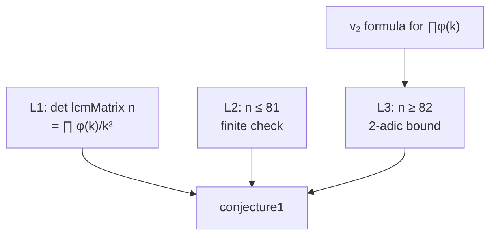

# PRD: Solving an Open OEIS Conjecture in Lean

Sep 24, 2026 · Jack Burrus

## Summary

Target: OEIS A060841, conjecture1. Robert G. Wilson v conjectured in 2015 that 1/det(M), where M is the n×n matrix with M[i,j] = 1/lcm(i,j), is an integer exactly when n is 1 to 34, 36 or 38.
The goal is a kernel-checked Lean 4 proof of `OeisA60841.conjecture1` in google-deepmind/formal-conjectures, merged upstream and reported to the OEIS.

Why this one: the maintainers split it out as a standalone open statement on Sep 23, 2026, so no AI benchmark run has ever targeted it on its own.
A numerical check and an elementary proof sketch (below) suggest it is true and provable with a finite 2-adic argument plus a bounded computation.
The main engineering risk is formalizing the lcm-matrix determinant identity in Lean, not the number theory.

## Verification of open status

Every source checked on Sep 24, 2026 lists the integrality claim as unsolved.
Only the second half of Wilson's original conjecture (denominators are powers of two) has been settled, and it was disproved.

| Source | What it says | Checked |
| --- | --- | --- |
| formal-conjectures PR #6456 | Merged Sep 23, 2026. Splits the old conjunction; conjecture1 (integrality iff n ∈ 1..34, 36, 38) is tagged research open with no formal_proof. conjecture2 is marked solved (false at n = 1807). | Diff read line by line |
| OEIS A060841 | Keeps Wilson's conjecture text. The only resolution note is the n = 1807 counterexample to the denominator claim. | Full entry read |
| Adamczewski, OEIS Open (arXiv:2608.11941) | Appendix table lists A060841 as "Disproved" via n = 1807, a 3-adic computation. No proof of the integrality characterization. | Full paper read |
| Web and GitHub search | No paper, MathOverflow post, OEIS comment or open PR proving it. | Several queries on A060841, A001088, lcm matrix, (n!)²/∏φ(k) |

Why the benchmark never solved it: the original Lean target was a conjunction of both claims.
Disproving the easier half settled the whole target for $6, so no agent had a reason to prove the integrality half.

What I cannot guarantee (residual risk, not 100%):

- Someone may have an unpublished or in-flight proof. The split is one day old and Epoch and DeepMind run AI pipelines over these statements. Check the FC repo and the LeanOpenProblems issues again on the day work starts.
- A proof could exist in older literature under different notation that search did not surface. The elementary argument below makes this plausible, which also means it may not count as a major result.
- Numerically, I confirmed the exact integrality set {1..34, 36, 38} for all n ≤ 5,000, and that for every n ≥ 39 (and 35, 37) the 2-adic valuation alone breaks integrality up to n = 200,000.

## Problem background

The determinant has a known closed form, so the conjecture reduces to a question about 2-adic valuations of totients.

The Lean target, as merged:

```lean
theorem conjecture1 :
    ∀ n : ℕ, 1 ≤ n → (((lcmMatrix n).det)⁻¹.den = 1 ↔ n ∈ integerDetN)
-- integerDetN = Set.Icc 1 34 ∪ {36, 38}
```

Since 1/lcm(i,j) = gcd(i,j)/(ij), M = D⁻¹ G D⁻¹ with G the gcd matrix and D = diag(1..n).
Smith's 1875 determinant det G = ∏ φ(k) then gives:

$$\frac{1}{\det M_n} = \prod_{k=1}^{n} \frac{k^2}{\varphi(k)} = \frac{(n!)^2}{\varphi(1)\varphi(2)\cdots\varphi(n)}$$

For odd primes p the numerator usually wins.
The obstruction is the prime 2, and its valuation has an exact formula because φ(k) = ∏ p^(e−1)(p−1):

$$v_2\Big(\prod_{k\le n}\varphi(k)\Big) = v_2(n!) - \lfloor n/2 \rfloor + \sum_{3 \le p \le n} v_2(p-1)\,\lfloor n/p \rfloor$$

So the product fails to be an integer at 2 exactly when Σ v₂(p−1)⌊n/p⌋ over odd primes p ≤ n exceeds v₂(n!) + ⌊n/2⌋.
The left side grows like n·log log n and the right side like 1.5n, which is why integrality stops near n = 35.

Known partial results: the n = 1807 disproof of the denominator claim, whose Lean proof also works from the closed form (proof file).
That file is the best starting reference for totient and valuation lemmas.

## Goals and non-goals

Goals:

- A sorry-free Lean proof of `OeisA60841.conjecture1` against the exact merged statement, using only the three standard axioms (no `native_decide`).
- A merged formal-conjectures PR flipping the tag to research solved with a formal_proof link.
- An OEIS comment on A060841 recording the proof, and a short write-up (arXiv note or blog post) crediting the human+AI workflow.

Non-goals:

- Reproving the n = 1807 result or touching conjecture2.
- General theory of GCD/LCM matrices on arbitrary sets. Only the set {1..n} is needed.
- Upstreaming Smith's determinant to Mathlib. Worth doing later, but not on the critical path.

## Approach

The proof splits into three lemmas: a determinant identity, a finite check for n ≤ 81, and a uniform 2-adic bound for n ≥ 82.
I checked the numbers for the last two in Python; none of it is Lean-verified yet.



1. L1, determinant identity (hardest to formalize). Write G = A·diag(φ)·Aᵀ where A[i,d] = 1 if d divides i. A is unitriangular, so det G = ∏ φ(k) by Gauss's identity Σ_{d|m} φ(d) = m. Then scale by D⁻¹ on both sides. First check whether Mathlib, Tau Ceti or Lean Pool already has Smith's determinant.
2. L2, finite range n ≤ 81. Using L1, compute v₂ and every odd-prime valuation of (n!)²/∏φ(k) for each n by kernel-checkable decide/norm_num. This covers both directions of the iff for all small n, including 35 and 37.
3. L3, uniform bound for n ≥ 82. Take S = the 21 odd primes ≤ 79. Then Σ_{p∈S} v₂(p−1)/p ≈ 1.8956 and Σ_{p∈S} v₂(p−1)(1−1/p) ≈ 32.10. Using ⌊n/p⌋ ≥ n/p − (p−1)/p:

$$\sum_{p \in S} v_2(p-1)\lfloor n/p \rfloor \;\ge\; 1.8956\,n - 32.11 \;>\; 1.5\,n \;>\; v_2(n!) + \lfloor n/2 \rfloor \quad (n \ge 82)$$

so v₂ of the denominator is positive and 1/det is not an integer.
The rational constants are exact fractions, so this is a fixed finite sum plus linarith, with no analytic number theory.
Empirically the finite-S bound already holds from n = 51 onward, which gives slack.

Fallbacks if L1 stalls:

- Prove det G = ∏ φ(k) by induction on n with row operations (subtract row d from each multiple), instead of the factorization.
- Ask maintainers whether a statement using the closed form is acceptable as an interim research solved with a note, the same way the n = 1807 disproof was recorded.

## Tooling and agent workflow

Claude Code does the proving inside a local fork of formal-conjectures, with lake build as the only judge of success.

- Environment: fork google-deepmind/formal-conjectures at current main, build with its pinned Lean and Mathlib, and work in FormalConjectures/OEIS/60841.lean. Keep a scratch file per lemma (L1, L2, L3) so failures stay isolated.
- Agent loop: one Claude Code session per lemma. The CLAUDE.md states the exact target signature, forbids editing the statement or definitions, forbids native_decide and new axioms, and requires lake build after every change.
- Human role: you own the math plan above and review each lemma's statement before the agent starts proving it. The agent owns Lean syntax, Mathlib search and tactic grinding.
- Numerics harness: keep the Python scripts (valuation tables, the S-sum constants) in the repo so the agent can check any intermediate claim before trying to prove it.
- Final verification: run `#print axioms OeisA60841.conjecture1` (only propext, Quot.sound, Classical.choice), then Comparator or SafeVerify against an untouched copy of the statement, as Epoch does.

## Milestones

The plan fits in about three weeks of evenings, with L1 as the schedule risk.
Speed matters because the statement is now visible to every AI pipeline that scans formal-conjectures.

| Week | Milestone | Done when |
| --- | --- | --- |
| 0 (day 1) | Re-verify open status, build the fork | FC main still shows research open, no competing PR, lake build green |
| 1 | L3 (2-adic bound for n ≥ 82) | Lemma compiles with no sorry |
| 1 | L2 (finite check for n ≤ 81) stated against the closed form | Lemma compiles with no sorry |
| 2 | L1 (lcm determinant identity) | Lemma compiles with no sorry |
| 3 | Assemble conjecture1, axiom check, Comparator pass | Full file builds, only standard axioms |
| 3 | Submit PR, OEIS comment, write-up | PR open with proof link |

L3 and L2 go first on purpose: they are the novel math and the cheapest to finish, so a stall on L1 still leaves a publishable partial result.

## Success criteria and submission

Success means the formal-conjectures maintainers merge a PR marking conjecture1 as research solved with a pinned formal_proof link.

- Proof artifact: a pinned commit in your own public repo (for example under jackburrus), linked from the FC attribute the same way the A176477 proof is linked in PR #6456.
- PR format: follow recent solved-status PRs such as #5088: state what changed, how it was checked, and an AI disclosure line.
- OEIS: submit a comment on A060841 stating the conjecture is proved, with the proof link.
- Credit and labeling: record it on awesome-breakthroughs as human+ai, evidence source-accepted once merged. Be precise that the math plan was human-directed and the formalization agent-driven.
- Stretch: a 3 to 5 page arXiv note (math.NT) giving the elementary proof, since no human-readable proof exists yet.

## Risks and open questions

The biggest risk is being scooped, since the proof is short and the statement is newly visible.
The biggest technical risk is L1.

| Risk | Likelihood | Mitigation |
| --- | --- | --- |
| Another person or AI pipeline proves it first | High | Start within days; do L3 and L2 first; re-check FC and LeanOpenProblems daily |
| L1 (Smith determinant) is painful in Mathlib's matrix API | Medium | Search Mathlib, Tau Ceti and Lean Pool first; fall back to row-reduction induction |
| Kernel decide too slow for n ≤ 81 products | Low | Compare valuations per prime instead of full products; split into range blocks |
| Statement has a subtle misformalization (e.g. lcmMatrix definition) | Low | Read the full 60841.lean definitions before starting and check small n against OEIS |
| Result seen as too easy to matter | Medium | Frame it honestly as a clean resolution of a 2015 OEIS conjecture, not a breakthrough |

Open questions:

- [ ] Does Mathlib or a companion library already contain det of the GCD matrix on {1..n}?
- [ ] Is the n ≥ 82 threshold worth pushing down to 51 to shrink the finite check, or is 81 cheap enough?
- [ ] Should the arXiv note be co-authored or credited to the agent run?

## Sources

- formal-conjectures PR #6456, statement split and diff
- OEIS A060841
- Adamczewski, OEIS Open, arXiv:2608.11941
- LeanOpenProblems issue #67 (library access, pinned Lean versions)
- OEIS A001088, product of totients
