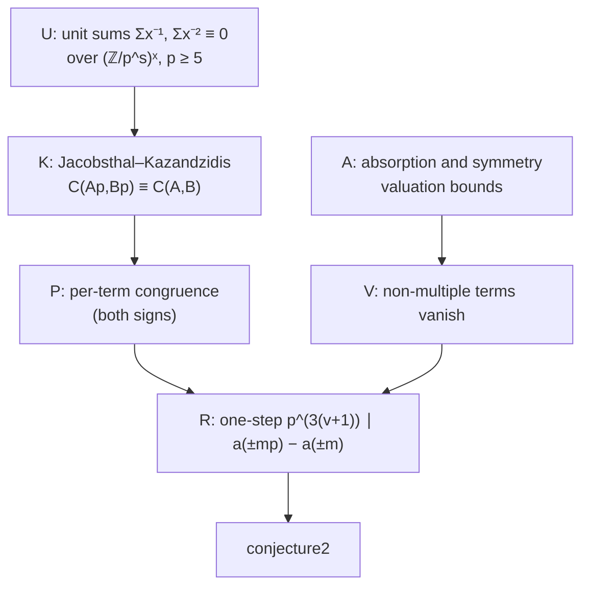

# PRD: OEIS A141057 Conjecture 2, Negative-Index Supercongruences for Abelian Cubes

Sep 24, 2026 · Draft for Jack Burrus (scout survey)

## Summary

Target: `OeisA141057.conjecture2` in google-deepmind/formal-conjectures, `FormalConjectures/OEIS/141057.lean:95-96` at main `2424bb4`.
Here a(n) = Σ_k C(n,k)³ Σ_j C(k,j)³ counts Abelian cubes.
Peter Bala conjectured that the supercongruences a(n p^k) ≡ a(n p^(k−1)) (mod p^(3k)), for primes p ≥ 5, also hold for his extension of a to negative n, where C(−m,k) = (−1)^k C(m+k−1,k).
The goal is a Comparator-verified Lean proof against the untouched statement.

Why this one: it has the same shape as A060841.
The positive-n half (`conjecture1`) was proved in August 2026 by an agent in Epoch's OEIS Open run, and FC links that proof.
The negative-n half is a separate statement that no benchmark has ever targeted.
It is the sibling of a solved statement, left open only because nobody pointed an agent at it.
The positive-case proof splits the sum term by term, and I checked numerically that the same term-by-term split holds for negative indices, including when p divides m (the case that decides k ≥ 2).

## Verification of open status

| Source | What it says | Checked |
| --- | --- | --- |
| formal-conjectures main `2424bb4` | `conjecture2` is `research open` with no `formal_proof`. `conjecture1` is `research solved`, linking Epoch run `oeis-full-50usd-ant-j0j0g4uzligm1k41/oeis_a141057_supercongruence_conjecture` (Claude Opus 4.8, accepted). | File read |
| FC PR #5594 (Sep 11, 2026) | Linked the proof of the positive supercongruences only. | PR list |
| OEIS A141057, rev 35 (Aug 20, 2026) | Bala's comment: the negative extension [−1, 255, −53893, …] "appears to satisfy the same supercongruences". A second comment says Adamczewski gave a proof abstract for the positive conjecture. Nothing on negative n. | Live entry read |
| Epoch OEIS Open dataset | Only `oeis_a141057_supercongruence_conjecture` (positive n). The negative statement entered FC later, via the AutoOeis PR #5016 of Aug 20, 2026. | `samples.jsonl` and run trees |
| AlphaProof Nexus, atlas-lean | No A141057 output. | Repo grep and tree |
| FC open PRs, GitHub search "141057" | Only the closed PRs #5016 and #5594. | Searched Sep 24 |

## Problem background

```lean
def aInt (n : ℤ) : ℤ :=
  if 0 ≤ n then (a n.toNat : ℤ)
  else ∑ k ∈ range ((-n).toNat + 1), ((-1)^k * ((-n).toNat + k - 1).choose k)^3 *
         ∑ j ∈ range (k + 1), (k.choose j)^3
theorem conjecture2 (p k : ℕ) (n : ℤ) (hp : p.Prime) (h_p_ge_5 : 5 ≤ p) (h_k_pos : 1 ≤ k)
    (hn : n ≠ 0) :
    aInt (n * (p ^ k : ℤ)) ≡ aInt (n * (p ^ (k - 1) : ℤ)) [ZMOD (p ^ (3 * k) : ℤ)]
```

FC's `aInt` matches Bala's definition: the first values −1, 255, −53893 agree with his OEIS comment.
The statement covers both signs of n, so the proof must also redo the positive case: FC's `conjecture1` is a `sorry` with a link, which Comparator would reject.

Proof sketch, the Epoch/Jacobsthal argument transposed.
Take m ≥ 1 and N = mp.
Write aInt(−N) = Σ_{j ≤ k ≤ N} T(k, j) with T(k, j) = (C(−N,k)·C(k,j))³.
It suffices to prove the one-step claim p^(3(v_p(m)+1)) ∣ aInt(−mp) − aInt(−m), then set m = n p^(k−1).

1. **Pairs not both divisible by p vanish.** Absorption gives k·C(N+k−1,k) = N·C(N+k−1,k−1), so v_p(C(−N,k)) ≥ v_p(N) − v_p(k) = v_p(m) + 1 when p ∤ k. The multinomial symmetry C(N+k−1,k)·C(k,j) = C(N+j−1,j)·C(N+k−1,k−j) handles p ∤ j. Cubing gives p^(3(v_p(m)+1)) ∣ T(k, j).
2. **Multiple pairs match the smaller sum.** For (k, j) = (ip, lp), use C(−mp, ip) = (−1)^i · (m/(m+i)) · C((m+i)p, ip) and the same identity at p = 1. The strengthened Jacobsthal congruence C(Ap,Bp) ≡ C(A,B) (mod p^(v_p(C(A,B)) + 3 + 3·min(v_p B, v_p(A−B)))) then gives T(ip, lp) ≡ (C(−m,i)·C(i,l))³ (mod p^(3(v_p(m)+1))). This is Epoch's lemma `kazan`, and the cube step is its `perterm`.
3. Summing gives the one-step claim. The positive case is the same argument with Epoch's decomposition.

## Evidence

`numerics/check.py` uses exact integers and the standard library only.

- The supercongruence holds in all 256 cases with n ∈ [−12, 12] ∖ {0}, |n|·p^k ≤ 700, p ∈ {5, …, 23} and k ≤ 3.
- The term-by-term split holds for all 51,645 terms with N = mp ≤ 160 and p ∈ {5, 7, 11}, including m = 5, 7, 10, 11, where v_p(m) = 1. This is the case the k ≥ 2 statement needs.
- By contrast, the analogous split for A003161 fails when p ∣ m.

## Goals and non-goals

Goals:

- A sorry-free proof of `OeisA141057.conjecture2`, covering both signs, with standard axioms and a Comparator pass.
- Material the owner can use for an FC PR and an OEIS comment.

Non-goals:

- General Apéry-like families, and upstreaming Jacobsthal–Kazandzidis to Mathlib (later).

## Approach



The lemma list mirrors Epoch's accepted positive-case file (`Spec.lean`, 978 lines: `US_inv`, `dvd_e2`, `dvd_T1`, `kazan`, `perterm`, `Claim1`, `red`).
That repo has no license file, so use it as a map and write our own code, or ask Epoch for permission (an owner decision).
The new work is the negative-index versions of A, P and V, plus a sign case split in the main theorem.

## Milestones

| Week | Milestone | Done when |
| --- | --- | --- |
| 0 | Re-verify status; decide on reusing Epoch's code | Owner decision recorded |
| 1 | U, K and A | Compile with no sorry |
| 2 | P and V for both signs; R | Compile with no sorry |
| 2–3 | Main theorem, axioms, Comparator | Comparator passes |

## Risks and open questions

| Risk | Likelihood | Mitigation |
| --- | --- | --- |
| Rebuilding the ~1000-line positive-case machinery without copying unlicensed code | Medium | Ask Epoch for a license, or re-derive from the natural-language proof in their `metadata.json` |
| Negative-index bookkeeping (`Int.toNat`, signs, the `n ≠ 0` split) | Medium | Prove `red` for ℕ inputs m in both forms, then transport to ℤ once |
| Scooped by Epoch or others | Medium | The positive proof is public, so the negative case is an obvious next target; start soon |
| Bala's comment stays conjectural in other normalizations | Low | FC's statement is the target; the numerics confirm FC's `aInt` |

- [ ] Ask Epoch (Tom Adamczewski) about licensing LeanOpenProblems-results code? Owner's call.

## Sources

- FC `FormalConjectures/OEIS/141057.lean` at `2424bb4`, PRs #5016 and #5594
- OEIS A141057 (rev 35, Aug 20, 2026)
- epoch-research/LeanOpenProblems-results `runs/oeis-full-50usd-ant-j0j0g4uzligm1k41/oeis_a141057_supercongruence_conjecture/` (`Spec.lean`, `metadata.json`)
- Jacobsthal's congruence (1952), and its Kazandzidis strengthening, as used there
